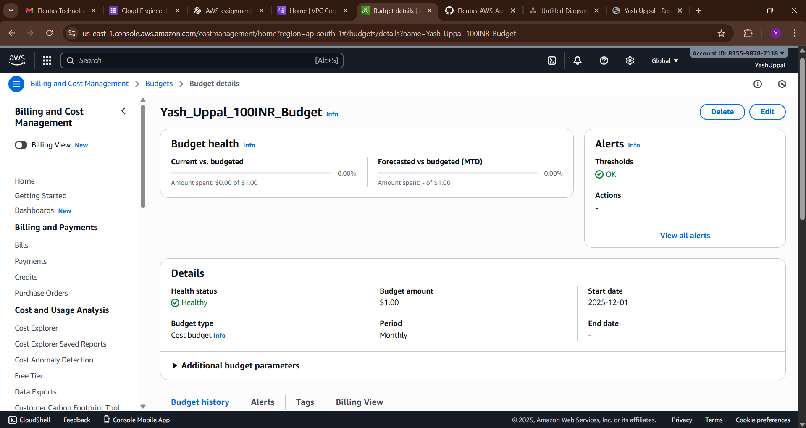

# Task 4: Billing & Free Tier Cost Monitoring

## Why Cost Monitoring is Important for Beginners

Cost monitoring is critical for beginners using AWS Free Tier because:

1. **Free Tier Limits Exist**: AWS Free Tier offers limited resources for 12 months. Exceeding limits results in charges.
2. **Unexpected Bills**: Services like NAT Gateway, data transfer, and load balancers can incur costs quickly if not monitored.
3. **Budget Control**: Setting alarms prevents surprise charges on your credit card.
4. **Resource Awareness**: Monitoring helps you understand which services consume resources and cost the most.
5. **Learning Protection**: As a student learning AWS, cost alerts protect you from expensive mistakes while experimenting.
6. **Professional Practice**: Cost monitoring is industry best practice for production environments.

## What Causes Sudden AWS Bill Increases

| Cause | Impact | Prevention |
|-------|--------|-----------|
| **NAT Gateway Charges** | ₹32/hour + ₹0.09/GB data transfer | Use NAT instances for testing or EC2 in public subnet |
| **Excessive Data Transfer** | Outbound internet data costs ₹0.09/GB | Monitor bandwidth usage, use CloudFront |
| **Load Balancer Hours** | ALB costs ₹0.0252/hour (~₹18/month) | Delete ALB when not needed |
| **EC2 On-Demand Pricing** | t2.micro free for 750 hours/month only | Track monthly usage, stop unused instances |
| **RDS Database** | Not free tier if using provisioned capacity | Use DynamoDB or Aurora Serverless for free tier |
| **EBS Storage** | 30 GB free/month only | Delete unused volumes and snapshots |
| **CloudWatch Logs** | Logs ingestion costs after free tier | Set retention policies, use log filters |
| **Elastic IPs** | ₹0.32 per unused EIP per hour | Release unused Elastic IPs |
| **VPN/Direct Connect** | Expensive for always-on connections | Avoid for development/testing |
| **S3 Storage** | 5 GB free/month only | Implement lifecycle policies, delete old objects |

## Monitoring Setup

### CloudWatch Billing Alarm (₹100 threshold)
- Monitors estimated daily charges in INR currency
- Sends email alert when charges reach ₹100
- Helps catch unexpected cost spikes early

### Free Tier Usage Alerts
- EC2 CPU utilization alert (80% threshold indicates potential issues)
- NAT Gateway data transfer monitoring (1 GB threshold)
- SNS topic sends email notifications for all alerts

### Email Notifications
- All alarms configured to send emails via SNS
- Subscribe with your email to receive instant alerts
- Respond quickly to unusual activity

## Screenshots

- Cost Budget (₹100) with email alerts: 

## Best Practices for Free Tier

1. **Delete Resources After Testing**: Remove EC2, NAT Gateways, ALBs when done
2. **Use Free Tier Eligible Instances**: t2.micro, t3.micro only
3. **Monitor Daily**: Check AWS Billing Dashboard regularly
4. **Set Multiple Alerts**: Use various thresholds (₹50, ₹75, ₹100)
5. **Review Monthly Bills**: Understand what you're being charged for
6. **Use Cost Explorer**: Visualize spending by service
7. **Stop Unused Resources**: Don't delete, just stop to preserve configurations
8. **Set Budget Alerts**: Use AWS Budgets for granular control

## Terraform Code

See `main.tf` for complete monitoring infrastructure with:
- SNS topic for alarm notifications
- Email subscription (update with your email)
- Billing alarm at ₹100 threshold
- Free Tier resource usage alarms
- Multi-metric monitoring approach
